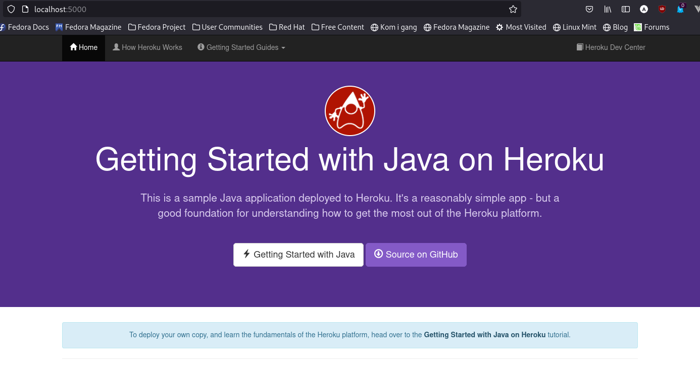

### Installing dependencies
In the past I've had problems managing different Java versions. This is why I currently use SDKman to manage Java installs

```
curl -s "https://get.sdkman.io" | bash
source "$HOME/.sdkman/bin/sdkman-init.sh"
```

Verify SDKman installation

```
sdk version
SDKMAN 5.11.2+698
```

Install Java 15

```
sdk install java 15.0.1-zulu
```

Verify Java 15

```
sdk current
java: 15.0.1-zulu

java -version
openjdk version "15.0.1" 2020-10-20
```

This also verifiable within Java programs running

```
System.getProperty("java.version");
```

Install maven
```
sudo dnf install maven
```

Verify maven
```
mvn -version
Apache Maven 3.6.3 (Red Hat 3.6.3-5)
```

### Installing Heroku

```
sudo snap install heroku --classic
```

Verify Heroku is installed

```
heroku --version
heroku/7.59.0 linux-x64 node-v12.21.0
```

Login

```
heroku login
```

### Deploying app
```
git clone https://github.com/heroku/java-getting-started
cd java-getting-started
heroku create
git push origin main
heroku ps:scale web=1
```

Verify the app is running

```
heroku open
```

An error occured and the command was unable to automatically open the URL in my browser. However the command outputs the URL which takes you directly to the deployed app: https://powerful-taiga-12073.herokuapp.com/


### Locally

With Java 15 installed I had no issue building and running the web app (which uses Java 8)

```
mvn clean install
heroku local web
```

The web app could be accessed at http://localhost:5000



URL: [https://powerful-taiga-12073.herokuapp.com/](https://powerful-taiga-12073.herokuapp.com/)


