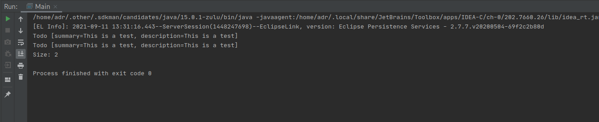
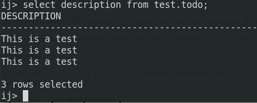
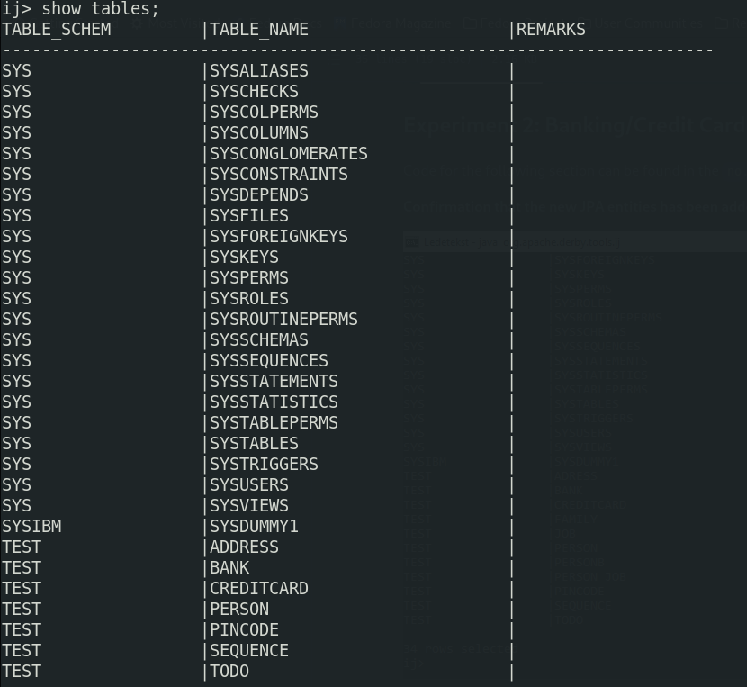
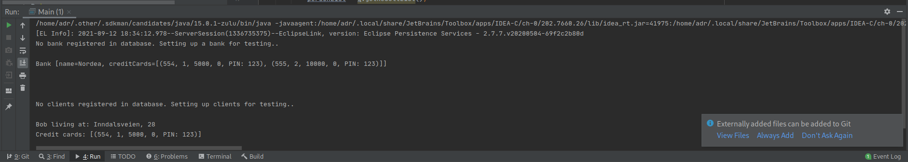
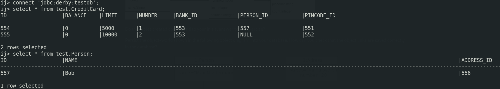

## Experiment 1

Verify tables/rows printing values to IDE

```
cd dat250-jpa-example
```

Verify tables/rows are created using `java org.apache.derby.tools.ij`

```
connect 'jdbc:derby:testdb';
select description from test.todo;
```



## Experiment 2

#### Synchronizing bidirectional entity associations
Using *bidirectional association* each object that add/remove/modify some entity relation must reflect the same change in the other object, e.g. `pincode.add(creditcard)` is followed by `creditcard.setPincode(pincode)`. All this is handled on the `OneToMany` side of the relationship (`Pincode`'s `addCreditcard()` method.) 

#### Equality checks
When an object is persisted/merged it may diverge from the original object due to being assigned an auto generated primary key. To make equality checks consistent across all entity state transitions we override the `equals()` and `hashCode()` methods in *child entities* (`ManyToOne`). 

### Problems

I tried to add a pincode to a creditcard and a creditcard to a bank and finally `persist(bank)` but got the following error.
```
During synchronization a new object was found through a relationship that was not marked cascade PERSIST (Pincode)
```

I solved this issue by making sure the pincode instance was persisted to the database before `persist(bank)`

When overriding `Bank`'s `toString()` method I tried printing the corresponding creditcards associated with the bank but got a `creditCards={IndirectList: not instantiated}`. This was apparently due to how `IndirectCollection` is implemented where it won't instantiate the object upon invoking `toString()` (will not trigger a database read). 

I solved this by changing `fetch` from `FetchType.LAZY` to `FetchType.EAGER`
```
@OneToMany(
    fetch = FetchType.EAGER,
    ...
)
private List<CreditCard> creditCardList;
```

### Database
Database tables can be listed using `java org.apache.derby.tools.ij` with the command `show tables;`


The code checks if the database is empty and in that case it creates some objects and persist them to the database.


Through the `java org.apache.derby.tools.ij` tool I was able to inspect the database outside the running time of the application

