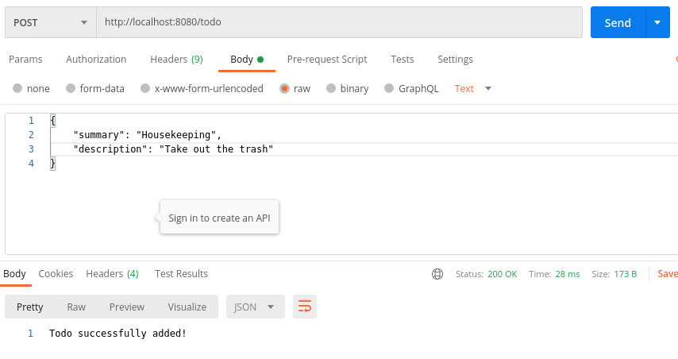

The assignment went pretty smooth with just some minor hiccups (syntax errors and such). The most challenging task was to create a good response to faulty data coming in from the request: json data not matching Todo class, updating (put) todo item that does not exist (create it?). 

### Postman

### Code

## Link to code

- [Spark routes](sparkjava-counter/src/main/java/no/hvl/dat110/rest/counters/App.java)
- [Model](sparkjava-counter/src/main/java/no/hvl/dat110/rest/model/Todo.java)
- [DAO](sparkjava-counter/src/main/java/no/hvl/dat110/rest/dao)
